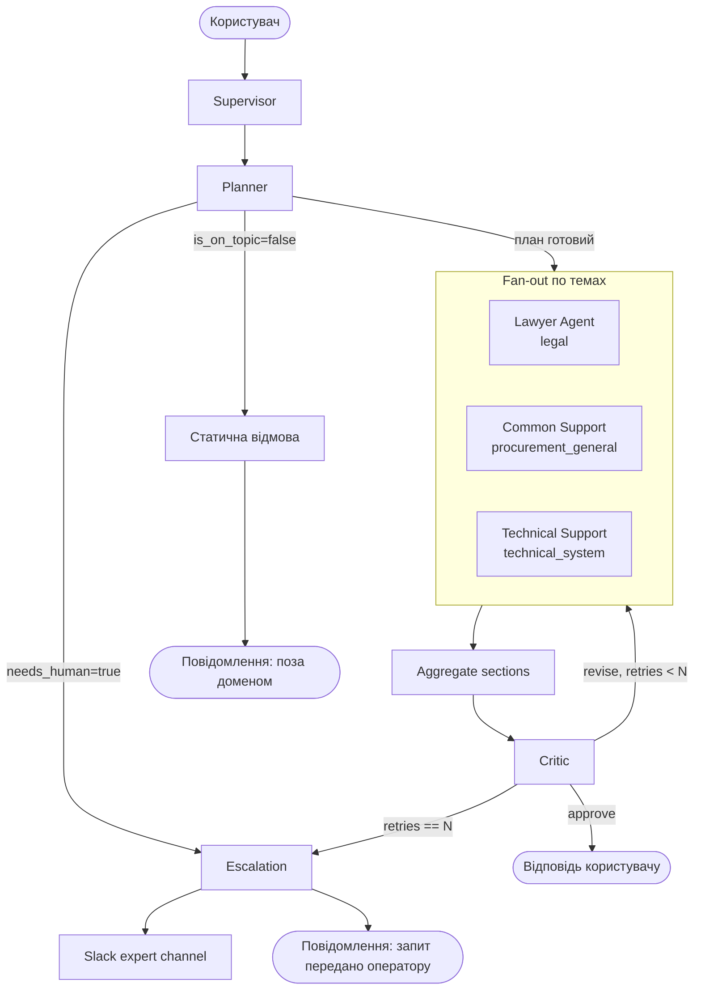

# Prozorro Support Assistant

Мультиагентна система підтримки користувачів електронної системи публічних закупівель України (ЕСЗ / Prozorro). Побудована на LangGraph за патерном **Orchestrator-Workers + Evaluator-Optimizer** від Anthropic.

> **Документація:** [Архітектура](docs/ARCHITECTURE.md) · [Чеклист реалізації](docs/DELIVERY_CHECKLIST.md) · [Технічне завдання](docs/Технічне%20завдання.md)

---

## Архітектура



### Агенти

| Агент | Тема | Інструменти |
|---|---|---|
| **Planner** | — | LLM structured output (`ResearchPlan`) |
| **Lawyer** | `legal` | RAG колекція `laws` |
| **Common Support** | `procurement_general` | RAG `articles` + Tavily web search |
| **Technical Support** | `technical_system` | RAG `articles` (tag-whitelist) + Tavily (domain-whitelist) |
| **Critic** | — | LLM structured output (`CritiqueResult`) |
| **Escalation** | — | Slack API, File System |

---

## Доменні обмеження

Система відповідає **виключно** на питання в трьох темах:

- `legal` — законодавство та нормативні акти у сфері публічних закупівель (Закон 922, КУпАП 164-14, КМУ 1178, …)
- `procurement_general` — процедури проведення закупівель, регламенти, порогові суми
- `technical_system` — технічна робота з ЕСЗ та електронними майданчиками

**Defense in depth** (три рівні захисту від off-topic):
1. **Planner gate** — `is_on_topic: bool` у `ResearchPlan`; при `false` Supervisor повертає статичне повідомлення без виклику воркерів
2. **System prompts** — кожен агент має директиву повертати порожній результат на питання поза доменом
3. **Critic guardrail** — вимір Structure валідує відсутність off-topic у фінальній відповіді

---

## Приклади запитів

### Happy path — одна тема

```
Який штраф передбачає стаття 164-14 КУпАП за порушення законодавства про закупівлі?
```

Planner → `[{topic: legal, query: "…"}]` → Lawyer шукає у колекції `laws` → Critic approve → відповідь з цитуванням редакції закону.

### Happy path — кілька тем

```
Поясни статтю 17 Закону 922 і як подати скаргу до АМКУ через систему Prozorro.
```

Planner → `[{topic: legal}, {topic: technical_system}]` → Lawyer + Technical Support паралельно → Aggregate → Critic approve → секційна відповідь.

### Off-topic

```
Який холодильник краще купити для дому?
```

Planner → `is_on_topic: false` → статичне повідомлення: *"Запит виходить за межі компетенції системи."*

### Escalation

```
Після підписання КЕП система Prozorro повертає помилку 500 при поданні пропозиції — це другий день поспіль.
```

Planner → `needs_human: true` → Escalation Agent → повідомлення в Slack expert channel + статус користувачу: *"Запит передано оператору технічної підтримки."*

---

## Quick Start

```bash
# 1. Встановити залежності
python -m venv .venv && source .venv/bin/activate
pip install -r requirements.txt

# 2. Налаштувати оточення
cp .env.example .env
# Заповнити ключі: OPENAI_API_KEY, TAVILY_API_KEY, QDRANT_URL, POSTGRES_URL, LANGFUSE_*

# 3. Запустити інфраструктуру (Qdrant + Postgres)
docker compose up -d

# 4. Проіндексувати дані
python -m ingest.run_ingest --collection=all

# 5. Синхронізувати промпти в Langfuse (один раз)
python scripts/sync_prompts.py

# 6. Запустити асистента
python main.py
```

### Тести

```bash
# Unit-тести (не потребують API key)
pytest tests/ -q -m "not eval"

# LLM evals (потребують OPENAI_API_KEY або ANTHROPIC_API_KEY)
pytest -m eval tests/
deepeval test run tests/evaluations/
```

## Deploy on Render

Для живого демо цей репозиторій підготовлений під `Render` як Python web service у Slack HTTP mode.

### Що вже є в репозиторії

- [`render.yaml`](render.yaml) — базова конфігурація Render Blueprint
- [`render_app.py`](render_app.py) — мінімальний Flask entrypoint для швидкого старту на Render
- HTTP endpoint для Slack events: `/slack/events`
- health check endpoint: `/healthz`

### Що треба підняти перед деплоєм

1. Зовнішній `Postgres` для `POSTGRES_URL`
2. Зовнішній `Qdrant` або `Qdrant Cloud` для `QDRANT_URL`
3. Заповнити всі потрібні env vars у Render:
   - `OPENAI_API_KEY`
   - `TAVILY_API_KEY`
   - `POSTGRES_URL`
   - `QDRANT_URL`
   - `QDRANT_API_KEY` за потреби
   - `SLACK_BOT_TOKEN`
   - `SLACK_SIGNING_SECRET`
   - `SLACK_USER_CHANNEL_ID`
   - `SLACK_EXPERT_CHANNEL_ID`
   - `LANGFUSE_PUBLIC_KEY`
   - `LANGFUSE_SECRET_KEY`

> Важливо: промпти завантажуються з Langfuse під час runtime, тому без `LANGFUSE_*` сервіс не відповідатиме.

### Порядок запуску

1. Створити Qdrant/Postgres
2. Проіндексувати дані:

```bash
python3 -m ingest.run_ingest --collection=all
```

3. Створити в Render `Web Service` з цього репозиторію
4. Або імпортувати [`render.yaml`](render.yaml), або задати вручну:
   - Build Command: `pip install -r requirements.txt`
   - Start Command: `gunicorn render_app:app --bind 0.0.0.0:$PORT --workers 1 --threads 8 --timeout 180 --access-logfile - --error-logfile - --capture-output`
5. Додати всі env vars
   - для free instance на Render варто також додати `ENABLE_RERANKER=false`, інакше локальна HuggingFace-модель reranker часто вибиває процес по пам'яті
6. У Slack App налаштувати:
   - `Event Subscriptions` -> `Request URL` = `https://<your-service>.onrender.com/slack/events`
   - підписку на `app_mention`
7. Перевстановити Slack app у workspace після зміни Event Subscriptions, якщо Slack цього вимагає

### Обмеження демо-версії

- Файли ескалацій пишуться локально в `output/escalations`, тому на Render вони не є постійним сховищем
- Запити обробляються у background thread після швидкого HTTP ack для Slack; цього достатньо для демо, але не варто вважати це фінальною production-архітектурою

---

## Стек

| Компонент | Технологія |
|---|---|
| Граф агентів | LangGraph + LangChain ≥1.2 |
| LLM | OpenAI GPT-4o (через `config.py`) |
| Векторна БД | Qdrant (дві колекції: `laws`, `articles`) |
| Retrieval | Hybrid (semantic + BM25) + cross-encoder reranking (`BAAI/bge-reranker-base`) |
| Web search | Tavily API (`language=uk, country=UA`) |
| Сесії | PostgreSQL + `langgraph-checkpoint-postgres` |
| Трейсинг / промпти | Langfuse |
| Evals | DeepEval (GEval, AnswerRelevancy, ToolCorrectness) |
| Нотифікації | Slack API |

---

## Структура проєкту

```
.
├── main.py                        # Entry point (REPL / Slack bot)
├── supervisor.py                  # LangGraph graph + Supervisor node
├── schemas.py                     # Pydantic contracts (ResearchPlan, WorkerResponse, …)
├── config.py                      # Pydantic Settings — всі .env змінні
├── retriever.py                   # Hybrid search + cross-encoder reranking
├── final_response.py              # Aggregator: WorkerResponse[] → секційна відповідь
├── agents/
│   ├── planner.py
│   ├── lawyer.py
│   ├── common_support.py
│   ├── technical_support.py
│   ├── critic.py
│   └── escalation.py
├── tools/
│   ├── rag.py                     # RAG tools (rag_search, make_rag_search_articles)
│   ├── web_search.py              # Tavily wrapper з UA-фільтром
│   └── slack.py
├── ingest/
│   ├── run_ingest.py
│   ├── pipeline.py
│   └── chunkers.py
├── retrieval/
│   └── embeddings.py
├── scripts/                       # Data pipeline (scraping, export)
├── prompts/                       # Backup промптів (live — у Langfuse)
├── data/
│   ├── law/                       # JSONL: нормативна база
│   └── infobox/                   # JSONL: статті, FAQ, туторіали
├── tests/
│   ├── golden_dataset.json        # 15 прикладів (happy / edge / failure)
│   ├── test_tools.py              # Tool wiring (11 тестів)
│   ├── test_e2e.py                # E2E structural + eval тести
│   ├── evaluations/
│   │   └── test_eval_geval.py     # 10 GEval/ToolCorrectness метрик
│   └── results/                   # Baseline scores (авто-генерується)
├── docs/
│   ├── ARCHITECTURE.md
│   ├── DELIVERY_CHECKLIST.md
│   ├── Технічне завдання.md
│   └── patterns/
├── .env.example
├── requirements.txt
└── docker-compose.yml
```
